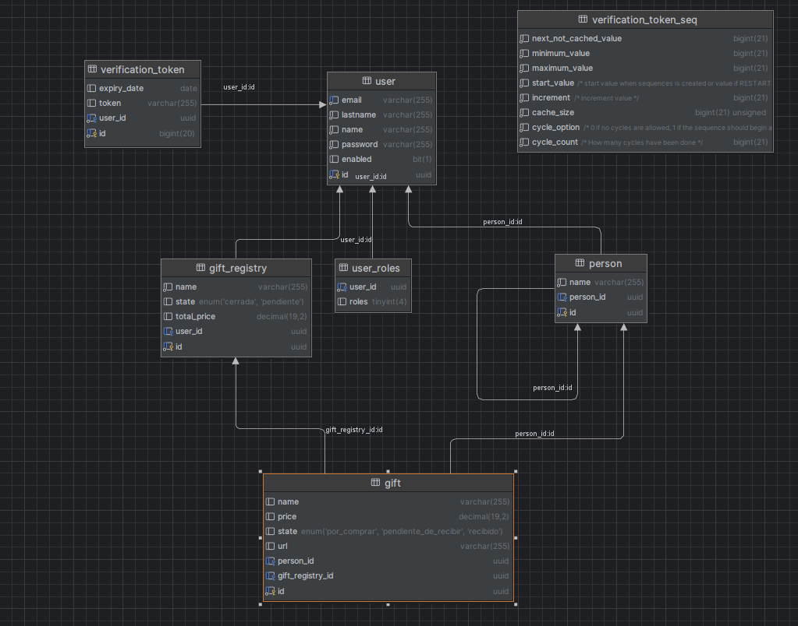

# gifty

Esta aplicación es un proyecto desarrollado para la asignatura de Ingeniería Web,
en el cual se han utilizado las tecnologías Spring y Vaadin como frameworks de 
backend y frontend, respectivamente. El proyecto consiste en una aplicación con 
funcionalidad de registro de usuarios, y su principal objetivo es organizar la 
compra de regalos para eventos específicos.

English

This application is a project developed for the Web Engineering course, in which 
Spring and Vaadin technologies have been used as backend and frontend frameworks,
respectively. The project is an application with user registration functionality, 
and its main purpose is to organize the purchase of gifts for specific events.

## Ejecutar aplicación

El proyecto es un proyecto estándar de Maven. Para ejecutarlo desde la línea
de comandos, escribe `mvnw` (Windows) o `./mvnw` (Mac y Linux), luego abre 
http://localhost:5000 en tu navegador.

The project is a standard Maven project. To run it from the command line,
type `mvnw` (Windows), or `./mvnw` (Mac & Linux), then open
http://localhost:5000 in your browser.

## Desplegar a produccion

Para crear una versión de producción, ejecuta `mvnw clean package -Pproduction`
en Windows, o `./mvnw clean package -Pproduction` en Mac y Linux.
Esto generará un archivo JAR con todas las dependencias y recursos front-end,
listo para ser desplegado. El archivo estará disponible en la carpeta designada 
una vez completada la construcción.

Una vez que el archivo JAR esté generado, puedes ejecutarlo utilizando
`java -jar target/gifty-1.0-SNAPSHOT.jar`

## Diagrama de clases

